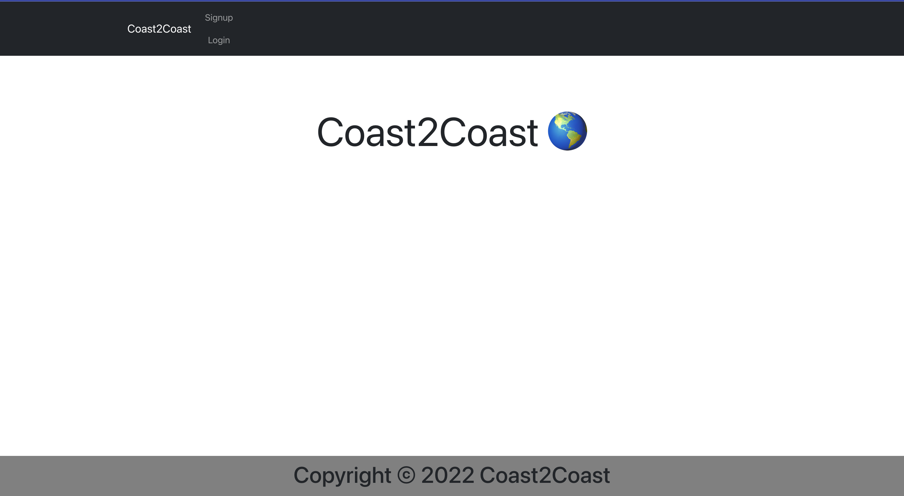
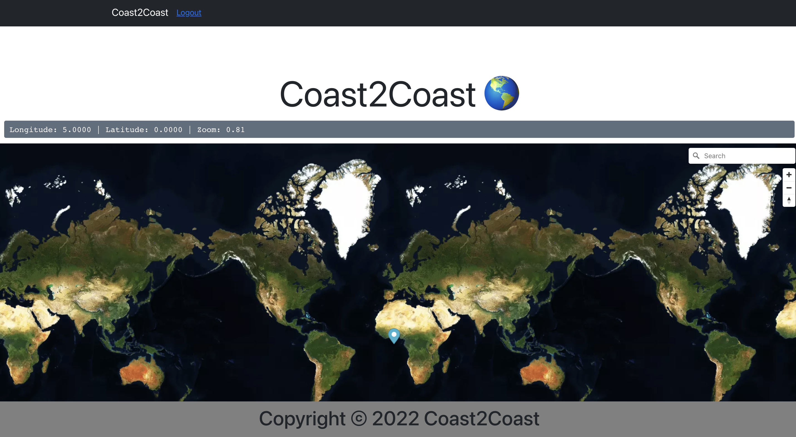

# COAST-2-COAST

## Description 

Coast-2-Coast is a app that utilizes mapbox API to search for any location on the map.The user can signup with a username, email and password, at that point the user is able to see a map. While logged in the user is able to put down markers on the map to indicate where they have been. The user would be able to leave a message about that location if they want. When done the user should be able to log out.

Please checkout my deployed app! **[Deployed App](https://coast-2-coast.herokuapp.com/)**

#### LogIn Page:

#### SignUp Page:

#### Main Page:

## Contribution
- Daniel Sapione  --- 
- Daniel Mendez  --- 
- Reggie Tenkorang  --- 
